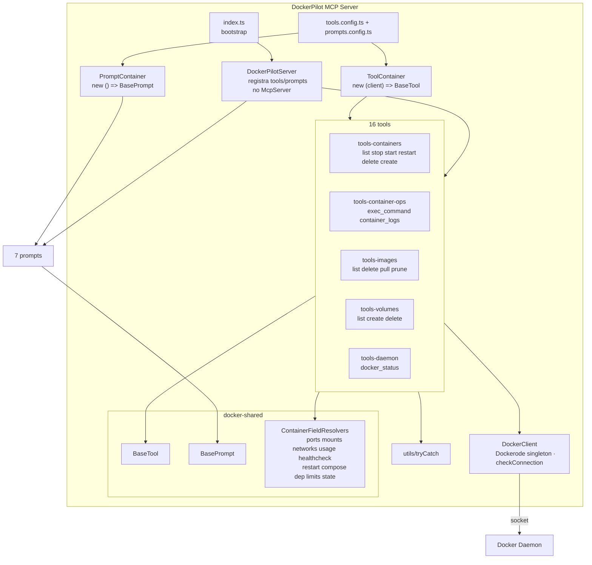

# C4 — Componentes (Nível 3)

> Gerado pelo Architect em 2026-08-13. 🟢 CONFIRMADO.

## Responsabilidades

| Componente | Responsabilidade | Depende de |
|------------|------------------|------------|
| `index.ts` | monta DI e inicia o servidor | DockerClient, ToolContainer, PromptContainer, DockerPilotServer |
| `DockerPilotServer` | cria `McpServer`, itera containers e registra | McpServer SDK |
| `ToolContainer` | instancia tools com o client | ToolConstructor[], DockerClient |
| `PromptContainer` | instancia prompts sem args | PromptConstructor[] |
| `BaseTool`/`BasePrompt` | contratos abstratos `register(server)` | McpServer |
| `ContainerFieldResolvers` | enriquecimento opcional de containers | Dockerode |
| `DockerClient` | wrapper do daemon + ping | Dockerode, socket |
| `tryCatch` | normalização de erros | — |
| 16 tools | operações do daemon via dockerode | DockerClient, tryCatch, (resolvers/shared) |
| 7 prompts | mensagens orientadoras | templates de mensagens |
