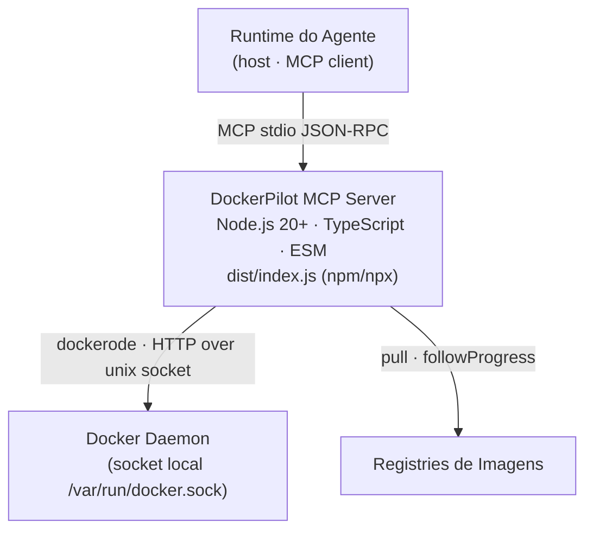

# C4 — Containers (Nível 2)

> Gerado pelo Architect em 2026-08-13. 🟢 CONFIRMADO.
> "Container" aqui = unidade de deploy/runtime (C4), não container Docker.

## Detalhe do deployable (DockerPilot MCP Server)

- Processo único Node.js; sem HTTP, sem banco, sem filas.
- Conecta ao `StdioServerTransport` — vive enquanto o agente estiver ativo.
- Dependência externa única de runtime: **Docker Engine acessível pelo socket do host**.
- Publicado como pacote npm; execução típica: `npx dockerpilot` (documentado no README para Claude Desktop / Cursor / VS Code / Copilot).

## Observações

- Não há Dockerfile; o servidor roda como processo do host para acessar o socket do daemon.
- O **runtime do agente** também executa `docker compose` (Bash) para os prompts compose_start/stop/restart.
