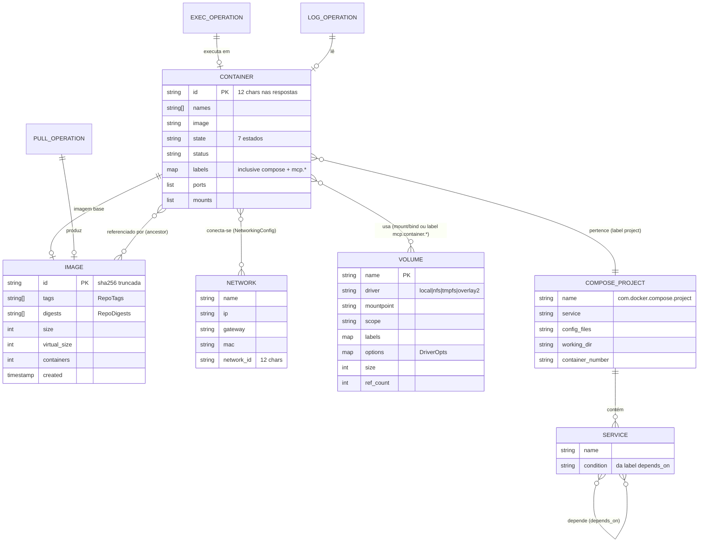

# ERD — Modelo Lógico (dockerpilot-mcp)

> Gerado pelo Architect em 2026-08-13. 🟢 CONFIRMADO.
> **Importante:** o sistema não persiste dados. As entidades abaixo são os **objetos do daemon Docker** expostos pela API e projetados nas respostas das tools (ver `data-dictionary.md`). ERD lógico/derivado, sem banco de dados.

## Entidades e cardinalidades

| Entidade | Chave | Atributos principais | Relacionamento |
|----------|-------|----------------------|----------------|
| `CONTAINER` | `id` | names, image, state, status, labels, ports, mounts | N→1 IMAGE; N:M NETWORK; N:M VOLUME; N→1 COMPOSE_PROJECT; 1:N EXEC/LOG |
| `IMAGE` | `id` | tags, digests, size, virtual_size, containers, created | 1:N CONTAINER (ancestor) |
| `VOLUME` | `name` | driver, mountpoint, scope, labels, options, size, ref_count | N:M CONTAINER |
| `NETWORK` | `name` | ip, gateway, mac, network_id | N:M CONTAINER |
| `COMPOSE_PROJECT` | `name` | service, config_files, working_dir, container_number | 1:N CONTAINER; 1:N SERVICE |
| `SERVICE` | `name` | condition | N:M SERVICE (depends_on) |
| `PULL_OPERATION` | — | image ref | 1:1 IMAGE |
| `EXEC_OPERATION` | — | command, exit_code | N:1 CONTAINER |
| `LOG_OPERATION` | — | tail | N:1 CONTAINER |

## Observações

- A associação CONTAINER↔VOLUME é dupla: (a) mounts reais via `HostConfig.Binds`/`Mounts`; (b) associação **simbólica por labels** (`mcp.container.id`/`mcp.container.name`) criada por `create_volume` sem montar (ADR/nota da tool).
- `SERVICE`↔`SERVICE` representa o grafo `depends_on` do Compose usado no BFS de stop/start (ADR-0004).
- Estados de CONTAINER e transitions: ver `state-machines.md`.
