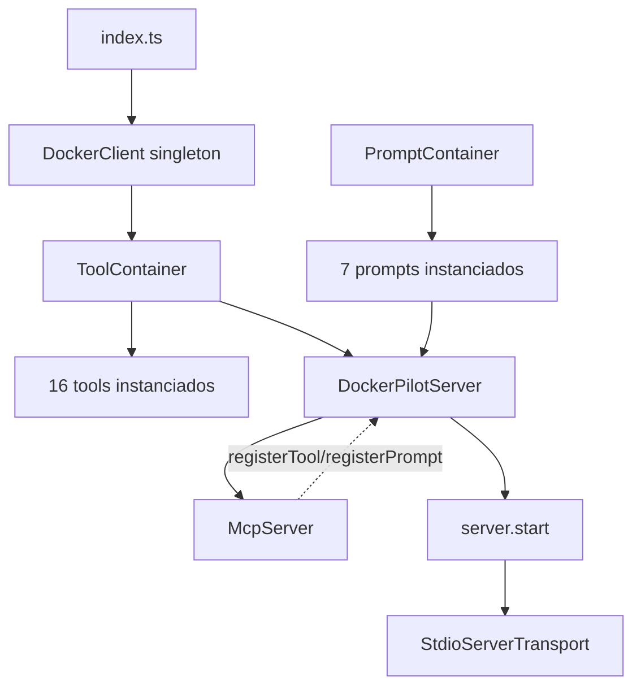

# Flowchart — core

```mermaid
flowchart TD
    A[index.ts] --> B[DockerClient singleton]
    B --> C[ToolContainer]
    C --> D[16 tools instanciados]
    E[PromptContainer] --> F[7 prompts instanciados]
    C --> G[DockerPilotServer]
    F --> G
    G --> H[McpServer]
    G --> I[server.start]
    I --> J[StdioServerTransport]
    H -.registerTool/registerPrompt.-> G
```
