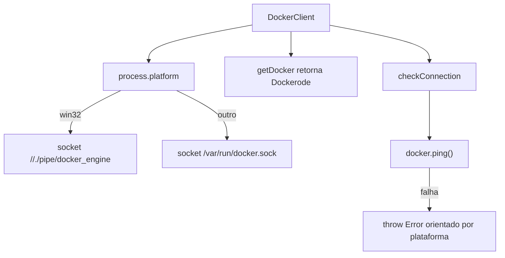

# Flowchart — docker-client

```mermaid
flowchart TD
    A[DockerClient] --> B[process.platform]
    B -->|win32| C["socket //./pipe/docker_engine"]
    B -->|outro| D["socket /var/run/docker.sock"]
    A --> E[getDocker retorna Dockerode]
    A --> F[checkConnection]
    F --> G["docker.ping()"]
    G -->|falha| H[throw Error orientado por plataforma]
```
