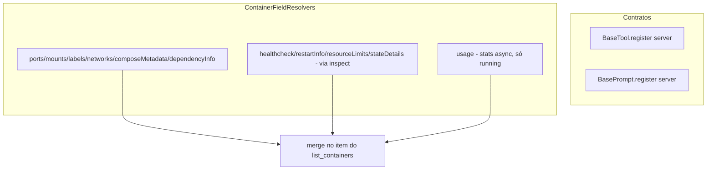

# Flowchart — docker-shared

```mermaid
flowchart TD
    subgraph Contratos
        A[BaseTool.register server]
        B[BasePrompt.register server]
    end
    subgraph ContainerFieldResolvers
        C[ports/mounts/labels/networks/composeMetadata/dependencyInfo]
        D[healthcheck/restartInfo/resourceLimits/stateDetails - via inspect]
        E["usage - stats async, só running"]
    end
    C --> F[merge no item do list_containers]
    D --> F
    E --> F
```
