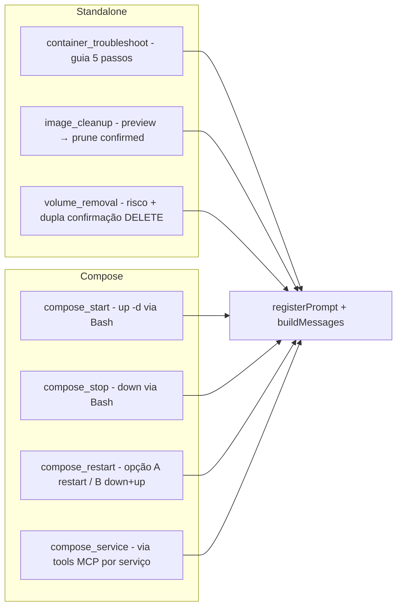

# Flowchart — prompts

```mermaid
flowchart LR
    subgraph Standalone
        A[container_troubleshoot - guia 5 passos]
        B[image_cleanup - preview → prune confirmed]
        C[volume_removal - risco + dupla confirmação DELETE]
    end
    subgraph Compose
        D[compose_start - up -d via Bash]
        E[compose_stop - down via Bash]
        F[compose_restart - opção A restart / B down+up]
        G[compose_service - via tools MCP por serviço]
    end
    H[registerPrompt + buildMessages]
    A --> H
    B --> H
    C --> H
    D --> H
    E --> H
    F --> H
    G --> H
```
