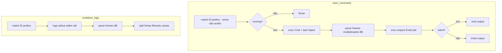

# Flowchart — tools-container-ops

```mermaid
flowchart TD
    subgraph exec_command
        A[match ID prefixo - nome não aceito] --> B{running?}
        B -->|não| C[throw]
        B -->|sim| D[exec Cmd + start hijack]
        D --> E[parse frames multiplexados 8B]
        E --> F[exec.inspect ExitCode]
        F --> G{silent?}
        G -->|sim| H[omit output]
        G -->|não| I[inclui output]
    end
    subgraph container_logs
        J[match ID prefixo] --> K[logs stdout stderr tail]
        K --> L[parse frames 8B]
        L --> M[split linhas filtrando vazias]
    end
```
