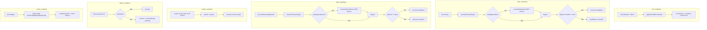

# Flowchart — tools-containers

```mermaid
flowchart TD
    subgraph list_containers
        A[listContainers + filters] --> B[applyClientFilter id/name]
        B --> C[enrich base + resolvers Promise.all]
    end
    subgraph stop_containers
        D[list running] --> E[resolvePrimaryTargets]
        E --> F{stopDependents?}
        F -->|sim| G[resolveDependents BFS reverso]
        G --> H[targets]
        F -->|não| H
        H --> I{dryRun? handler ?? true}
        I -->|sim| J[preview wouldStop]
        I -->|não| K[stop/kill por container]
    end
    subgraph start_containers
        L[list exited/created/paused] --> M[resolvePrimaryTargets]
        M --> N{startDependencies?}
        N -->|sim| O[resolveDependencies BFS inverso]
        O --> P[targets]
        N -->|não| P
        P --> Q{dryRun? ?? false}
        Q -->|sim| R[preview wouldStart]
        Q -->|não| S[start por container]
    end
    subgraph restart_container
        T[match nome exato ou ID prefixo] --> U[restart + inspect]
        U --> V[retorna id name status]
    end
    subgraph delete_container
        W[find por prefixo ID] --> X{confirmed?}
        X -->|não| Y[preview]
        X -->|sim| Z[remove + removeImage opcional]
    end
    subgraph create_container
        AA[pull imagem] --> AB[build config HostConfig/NetworkingConfig]
        AB --> AC[createContainer + start + inspect]
    end
```
