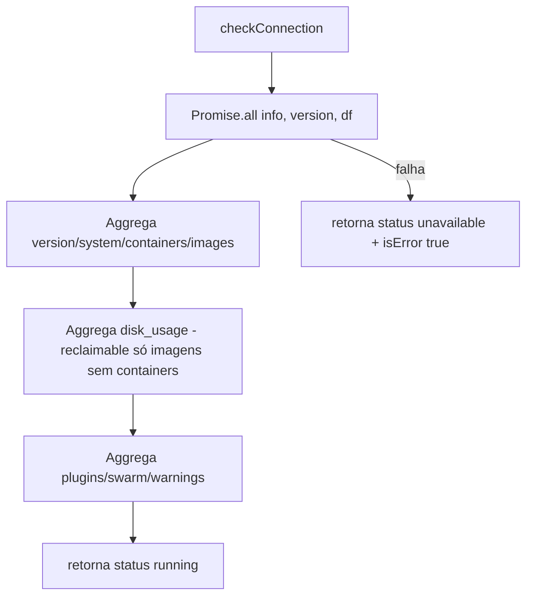

# Flowchart — tools-daemon

```mermaid
flowchart TD
    A[checkConnection] --> B["Promise.all info, version, df"]
    B --> C[Aggrega version/system/containers/images]
    C --> D[Aggrega disk_usage - reclaimable só imagens sem containers]
    D --> E[Aggrega plugins/swarm/warnings]
    E --> F[retorna status running]
    B -->|falha| G[retorna status unavailable + isError true]
```
