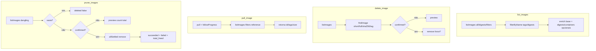

# Flowchart — tools-images

```mermaid
flowchart TD
    subgraph list_images
        A[listImages all/digests/filters] --> B[filterByName tags/digests]
        B --> C[enrich base + digests/containers opcionais]
    end
    subgraph delete_image
        D[listImages] --> E[findImage short/full/sha256/tag]
        E --> F{confirmed?}
        F -->|não| G[preview]
        F -->|sim| H[remove force?]
    end
    subgraph pull_image
        I[pull + followProgress] --> J[listImages filters reference]
        J --> K[retorna id/tags/size]
    end
    subgraph prune_images
        L[listImages dangling] --> M{vazia?}
        M -->|sim| N[deleted false]
        M -->|não| O{confirmed?}
        O -->|não| P[preview count total]
        O -->|sim| Q[allSettled remove]
        Q --> R[succeeded + failed + total_freed]
    end
```
