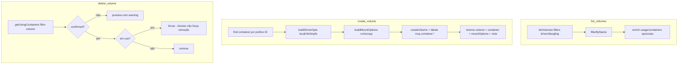

# Flowchart — tools-volumes

```mermaid
flowchart TD
    subgraph list_volumes
        A[listVolumes filters driver/dangling] --> B[filterByName]
        B --> C[enrich usage/containers opcionais]
    end
    subgraph create_volume
        D[find container por prefixo ID] --> E[buildDriverOpts local/nfs/tmpfs]
        E --> F[buildMountOptions ro/nocopy]
        F --> G[createVolume + labels mcp.container.*]
        G --> H[retorna volume + container + mountOptions + note]
    end
    subgraph delete_volume
        I[getUsingContainers filtro volume] --> J{confirmed?}
        J -->|não| K[preview com warning]
        J -->|sim| L{em uso?}
        L -->|sim| M[throw - Docker não força remoção]
        L -->|não| N[remove]
    end
```
