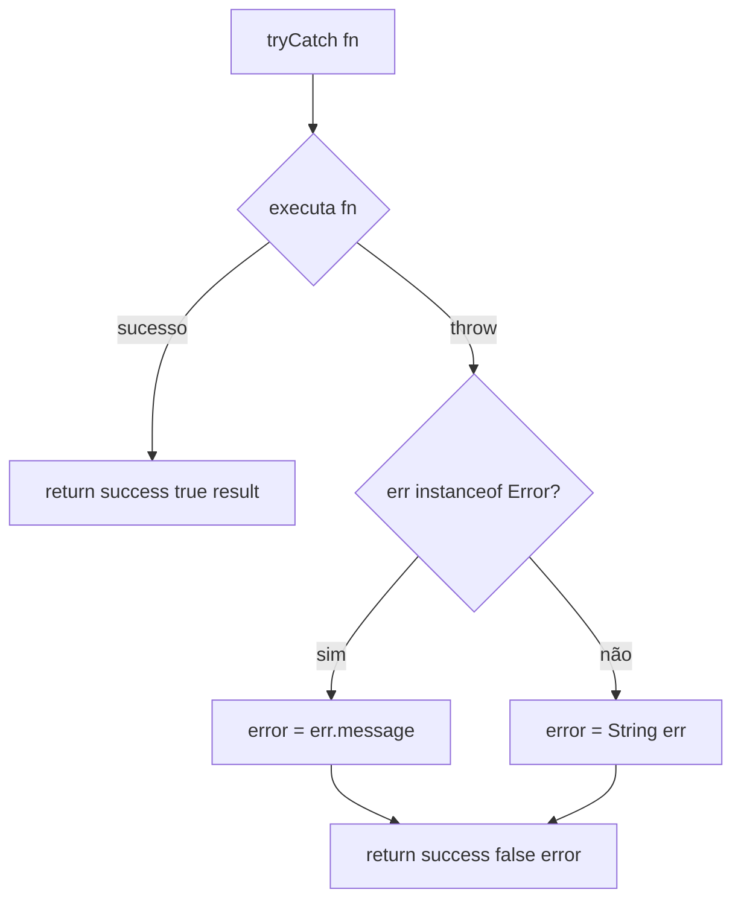

# Flowchart — utils

```mermaid
flowchart TD
    A[tryCatch fn] --> B{executa fn}
    B -->|sucesso| C[return success true result]
    B -->|throw| D{err instanceof Error?}
    D -->|sim| E[error = err.message]
    D -->|não| F[error = String err]
    E --> G[return success false error]
    F --> G
```
