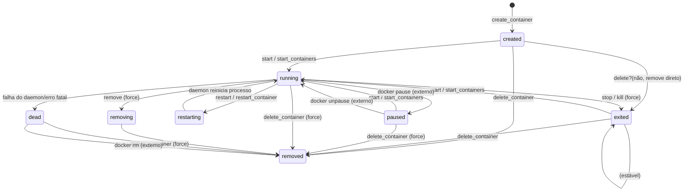
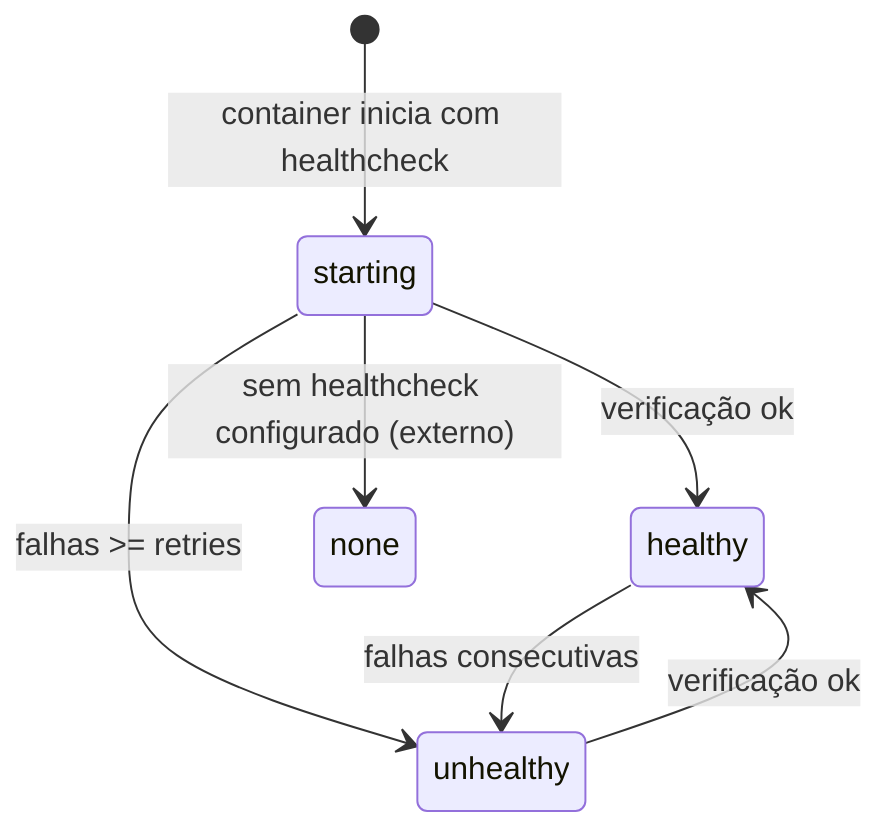
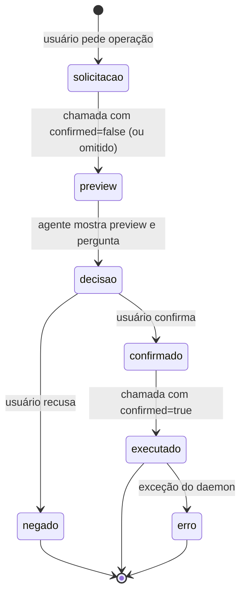
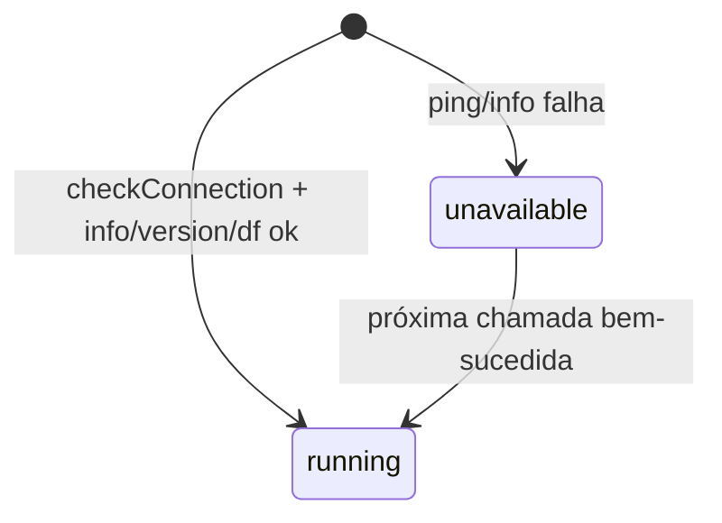

# Máquinas de Estado — dockerpilot-mcp

> Gerado pelo Detective em 2026-08-13. 🟢 CONFIRMADO (estados nativos do Docker; gatilhos lidos do código).

## 1. Estado de Container (entidade central)

### Valores possíveis (enum `VALID_STATES`)
`created`, `restarting`, `running`, `removing`, `paused`, `exited`, `dead`

### Transições acionadas pelas tools deste sistema
| De | Para | Gatilho | Condição |
|----|------|---------|----------|
| `exited` / `created` / `paused` | `running` | `start_containers` | candidato = estado ∈ {exited, created, paused} |
| `running` | `exited` | `stop_containers` | `stop({t: timeout})` ou `kill()` se `force` |
| `running` | `running` | `restart_container` | restart preserva estado final |
| qualquer | `removed` | `delete_container` | exige `confirmed=true`; `force` p/ running |
| `running` | `exited` | `stop_containers` com dependentes | dependentes param antes dos primários |

### Regras de transição
- 🟢 `start_containers` filtra por `status: ["exited","created","paused"]` — um container `restarting` **não** é candidato a start.
- 🟢 `exec_command` só opera em `running`.
- 🟢 `stop_containers` opera sobre `running` (list `all:false`).
- 🟢 Restart aceita qualquer estado (list `all:true`).

## 2. Estado de Healthcheck (do container)

- 🟢 Expo sto pelo resolver `healthcheck` (inspect): `status`, `failing_streak`, `last_log`.
- 🟢 `last_log` = último item do array `Log` (usado pelo `container_troubleshoot`).

## 3. Workflow de operações destrutivas (gate de confirmação)

Estado do **agente/usuário**, não do container:

- 🟢 Aplicável a: `delete_container`, `delete_image`, `delete_volume`, `prune_images`.
- 🟢 `delete_volume` tem estado adicional de **bloqueio**: se em uso → erro antes de executar.

## 4. Estado do daemon (docker_status)

- 🟢 Retorno: `{status:"running", ...}` vs `{status:"unavailable", error}` (isError true).
